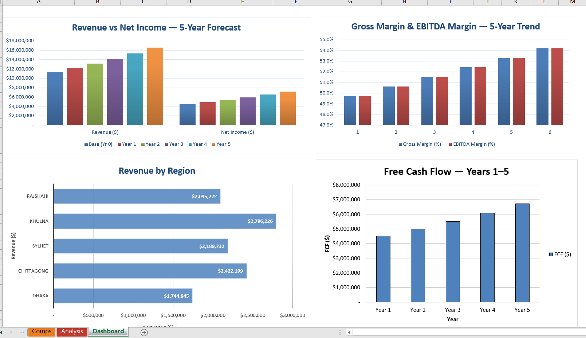
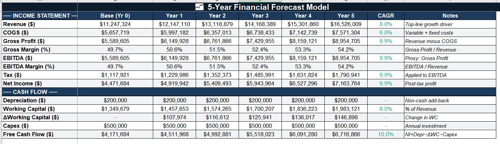
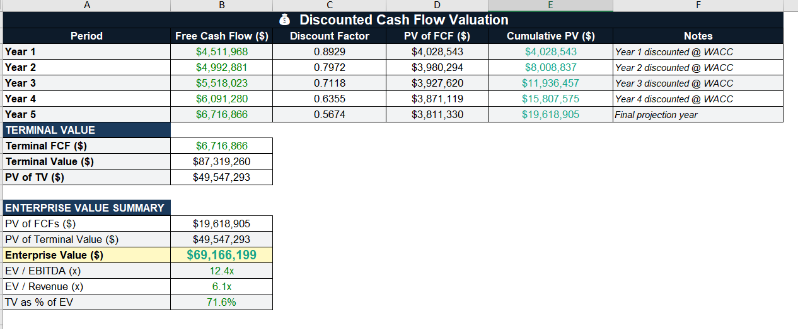
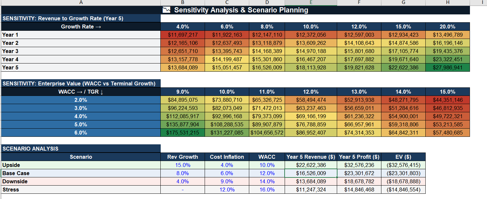
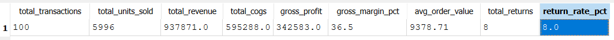
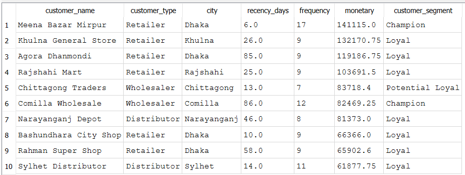
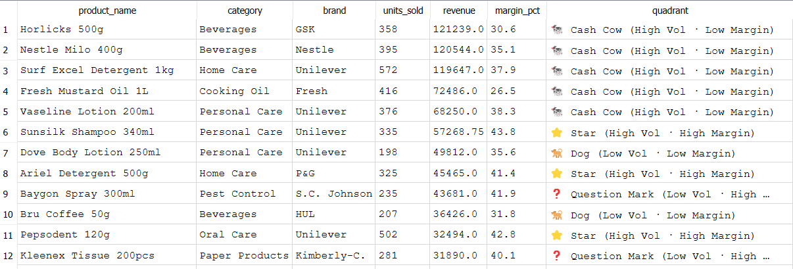

# FMCG Sales Analytics — Data Portfolio

**Tools:** Microsoft Excel · SQL (SQLite) · Power BI  
**Dataset:** 100 FMCG transactions · 20 SKUs · 10 customers · 5 salespersons · Bangladesh market  
**Scope:** Financial modeling · DCF valuation · SQL analytics · DAX measures · RFM segmentation

---

## Project 1 — Advanced Financial Model (Excel)

Built a professional-grade 8-sheet Excel financial model for an FMCG business operating across 5 cities in Bangladesh. The model flows from raw transaction data through a 5-year revenue forecast, DCF valuation, comparable company analysis, and scenario planning — all driven by a single Assumptions sheet so any input change cascades through the entire model automatically.

*Executive Dashboard — KPI cards, Revenue vs Net Income chart, and Gross Margin trend line*

*5-Year Financial Forecast — Revenue at 8% CAGR, cost inflation at 6%, with EBITDA, Net Income and Free Cash Flow*

*DCF Valuation — Discounted cash flows plus terminal value yielding the Enterprise Value at 12% WACC*

*Enterprise Value Sensitivity — 35 WACC × Terminal Growth Rate combinations, colour-scaled*

### Sheet Index

| Sheet | Contents |
|-------|----------|
| Raw_Data | 100 transactions with Revenue, Cost, Profit and Margin formulas. Conditional formatting on margins and revenue. |
| Calculations | Summary KPIs and regional + category breakdowns with % of total revenue |
| Assumptions | All model drivers (Revenue Growth 8%, WACC 12%, Tax 20% etc.) — single source of truth |
| Financial_Model | 5-year P&L and cash flow with CAGR column for every line item |
| Valuation_DCF | DCF model with discount factors, terminal value, EV/EBITDA, EV/Revenue, TV as % of EV |
| Comps | 5 Bangladesh-market peers with mean/median multiples and implied target valuation |
| Analysis | Revenue sensitivity heatmap + EV sensitivity heatmap + Upside/Base/Downside/Stress scenarios |
| Dashboard | KPI cards, regional table, 5-year snapshot, Revenue vs NI bar chart, Margin trend line chart |

### Skills
- Dynamic model architecture: one Assumptions sheet drives the entire model
- DCF valuation: Gordon Growth Model terminal value, WACC discounting, EV multiples
- Sensitivity analysis: two-variable heatmap across WACC and terminal growth rate
- Comparable company analysis: peer multiples with statistical summary and implied valuation
- Financial modeling conventions: blue = input, black = formula, green = cross-sheet link

---

## Project 2 — SQL Analytics (SQLite)

Designed a relational database for an FMCG sales operation and wrote 15 analytical SQL queries ranging from basic aggregations to advanced window functions, CTEs, and customer segmentation. Covers the full analyst SQL workflow: data modeling, KPIs, time-series analysis, performance ranking, and strategic segmentation.

*Q1 — Overall Business KPIs: total revenue, gross profit, margin %, average order value, return rate*

*Q6 — RFM Customer Segmentation: Champion, Loyal, Potential Loyal, At Risk segments*

*Q12 — Product Performance Quadrant: Star, Cash Cow, Question Mark, Dog using dynamic thresholds*

### Query Index

| Query | Business Question | SQL Concepts |
|-------|-------------------|--------------|
| Q1 — Business KPIs | What are the top-line numbers? | SUM, COUNT, AVG, derived metrics |
| Q2 — Revenue by Category | Which category drives the most profit? | JOIN, GROUP BY, SUM() OVER() |
| Q3 — Top 10 Products | Which products generate the most revenue? | JOIN, ORDER BY, LIMIT |
| Q4 — Monthly Trend + MoM Growth | Is revenue growing month-over-month? | CTE, LAG() window function |
| Q5 — Salesperson Scorecard | Who are the top performers? | RANK() window function |
| Q6 — RFM Segmentation | Which customers are most valuable or at risk? | CTE, JULIANDAY(), nested CASE |
| Q7 — City Revenue + Running Total | How does each city contribute cumulatively? | CTE, cumulative SUM() OVER() |
| Q8 — Channel Mix | Which sales channel is most profitable? | Window share %, return rate |
| Q9 — Brand Market Share | Which brand dominates? | RANK(), market share % |
| Q10 — Discount Impact | Do discounts justify the margin loss? | CASE bucketing, margin analysis |
| Q11 — Rolling 3-Month Average | What is the smoothed revenue trend? | ROWS BETWEEN window frame |
| Q12 — Product Quadrant | Stars, Cash Cows, Question Marks, Dogs? | Multi-CTE, subquery thresholds |
| Q13 — Payment Pivot | How do customer types prefer to pay? | Conditional aggregation with CASE |
| Q14 — Return Risk Flags | Which combinations have high return rates? | HAVING, CASE risk classification |
| Q15 — Executive Summary VIEW | Reusable cross-table summary | CREATE VIEW, 4-table JOIN |

## Files in This Repository

| File | Description |
|------|-------------|
| `Advanced_Financial_Model.xlsx` | 8-sheet Excel financial model |
| `fmcg_sales_project.sql` | All 15 SQL queries + DDL + INSERT statements |
| `fmcg_sales.db` | Ready-to-open SQLite database |
| `FMCG_PowerBI_Portfolio.pptx` | Power BI blueprint deck (10 slides) |

---

*To run the SQL project: download DB Browser for SQLite (sqlitebrowser.org), open `fmcg_sales.db`, go to Execute SQL tab and paste any query from the .sql file.*
